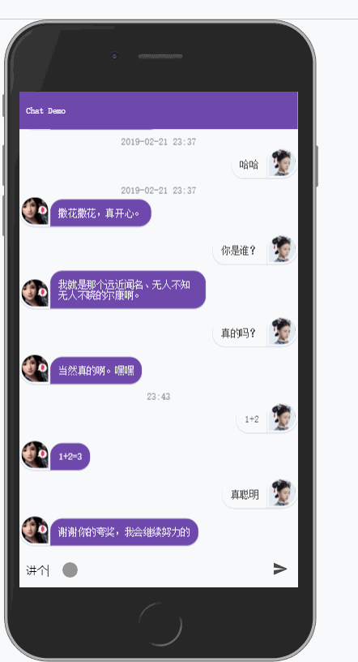

## 使用Create React App搭建的简易AI机器人聊天

包含服务端和客户端

### 快速开始

安装数据库可以看[这里](https://pq1949.github.io/article/20180814-centos%E5%AE%89%E8%A3%85mysql%E8%AE%B0%E5%BD%95/)， 也可以暂时用代码中我搭建的数据库，但不保证提供可靠服务，随时可能会被停掉

机器人使用的是免费的免费的图灵机器人，可以自己申请一个(我申请了个叫尔康的机器人), 地址在[这里](http://www.turingapi.com)

```bash
git clone https://github.com/pq1949/chatDemo.git

cd chatDemo

npm install

npm start
```

### 预览

[here](http://140.143.99.193:3001/)


